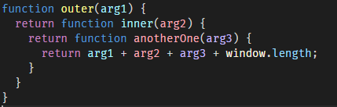
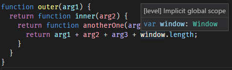

# VSCode-Levels -- Syntax Highlighting for JavaScript

This is a Visual Studio Code extension for JavaScript scope-based syntax highlighting.

* Scope-based identifier highlighting for JavaScript.
* Based on [Douglas Crockford's Idea](https://plus.google.com/u/0/+PaulIrish/posts/XjR4WmSDFAV)
* Utilizes [eslevels](https://github.com/mazurov/eslevels).
* Configurable colors.

## Features

It's great for identifying the scope of a variable at a glance.

 

It's also nice for detecting accidental re-use of the same identifier.

## Extension Settings

This extension contributes the following settings:

* `levels.colors`: An array of colors to use in order of scope.
  The first element is implicit global scope,
  the second is explicit global scope,
  and subsequent colors are for nested scopes.

## Release Notes

See [`CHANGELOG`](https://github.com/derflatulator/vscode-levels/blob/master/CHANGELOG.md)
